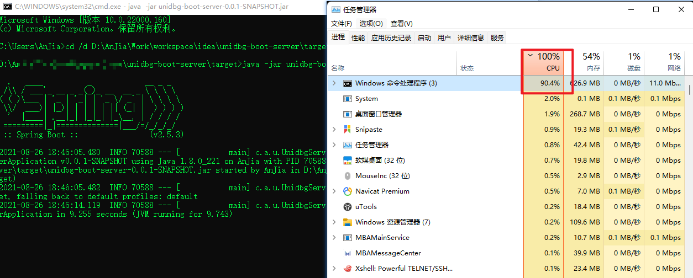

# 基于unidbg0.9.4和spring boot 2.5.3开发的高并发server服务器

## application.yml 讲解

```yaml
server:
  # 端口
  port: 9999

application:
  unidbg:
    # 是否启用 dynarmic 引擎
    dynarmic: false
    # 是否打印jni调用细节 vm.setVerbose()
    verbose: false

# 多线程相关
spring:
  task:
    execution:
      pool:
        allow-core-thread-timeout: true
        # 8个核心线程
        core-size: 8
        # 超过多久没用的线程自动释放
        keep-alive: 60s
        # 最多增长到多少线程
        max-size: 8
```

## 使用

```
# 打包
mvn package -T10 -DskipTests
# 运行
java -jar target\unidbg-boot-server-0.0.1-SNAPSHOT.jar
# 调用
curl  http://127.0.0.1:9999/api/tt-encrypt/encrypt
```

## 压测

```
[root@wrk]# docker run --rm  williamyeh/wrk -t12 -c400 -d30s http://127.0.0.1:9999/api/tt-encrypt/encrypt
Running 30s test @ http://127.0.0.1:9999/api/tt-encrypt/encrypt
  12 threads and 400 connections
  Thread Stats   Avg      Stdev     Max   +/- Stdev
    Latency   105.55ms   68.17ms 982.93ms   94.97%
    Req/Sec   341.43     55.05   460.00     80.70%
  120432 requests in 30.08s, 14.72MB read
  Socket errors: connect 0, read 0, write 81, timeout 0
Requests/sec:   4003.10
Transfer/sec:    501.09KB
```

瓶颈在cpu上


## 常见问题

### 高并发请求

参考 `com.anjia.unidbgserver.web.TTEncryptController` 和 `com.anjia.unidbgserver.service.TTEncrypt`
和 `com.anjia.unidbgserver.service.TTEncryptWorker` 和 `com.anjia.unidbgserver.service.TTEncryptTest`

主要unidbg模拟逻辑在 `com.anjia.unidbgserver.service.TTEncrypt` 里

`com.anjia.unidbgserver.web.TTEncryptController` 是暴露给外部http调用的

`com.anjia.unidbgserver.service.TTEncryptWorker` 是用多线程包装了一层

`com.anjia.unidbgserver.service.TTEncryptTest` 是单元测试

### 修改日志等级

修改 `logback-spring.xml`

例如 `<logger name="com.github.unidbg" level="WARN"/>`,意味着 `com.github.unidbg` 包 及该包名空间以下的只打印`WARN`和`ERROR`

### 升级spring boot或者unidbg版本

修改`pom.xml`

```xml
    <!-- 忽略其他部分 -->
<parent>
    <groupId>org.springframework.boot</groupId>
    <artifactId>spring-boot-starter-parent</artifactId>
    <version>2.5.3</version><!-- spring boot版本号 -->
    <relativePath/>
</parent>
        <!-- 忽略其他部分 -->
<properties>
<!-- 改成unidbg的版本号 -->
<unidbg.version>0.9.4</unidbg.version>
<!-- 忽略其他部分 -->
</properties>
        <!-- 忽略其他部分 -->
```